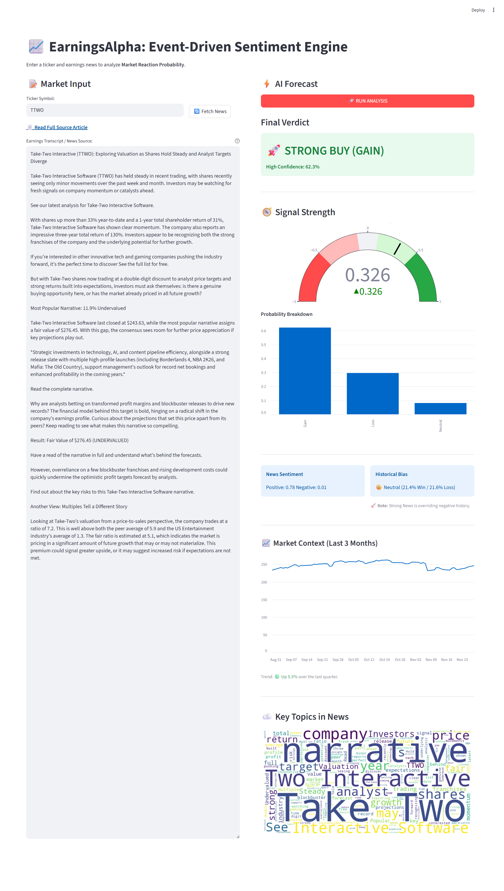
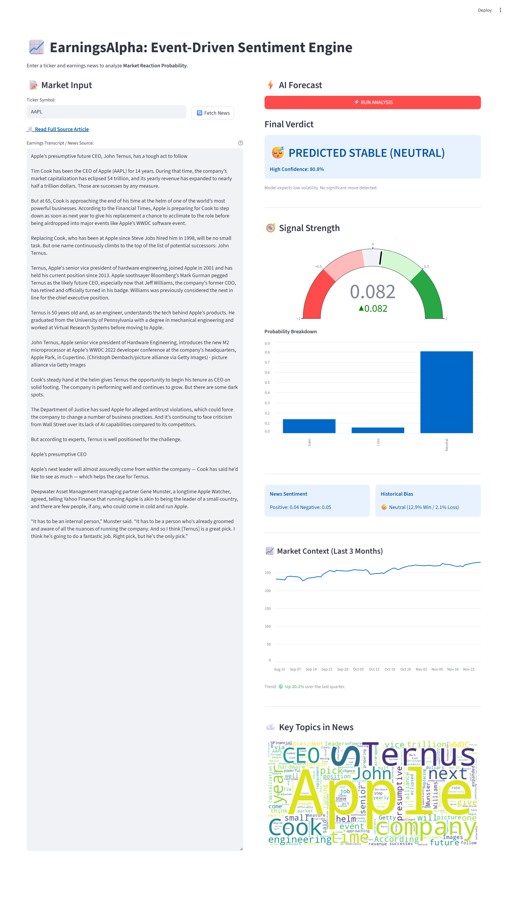
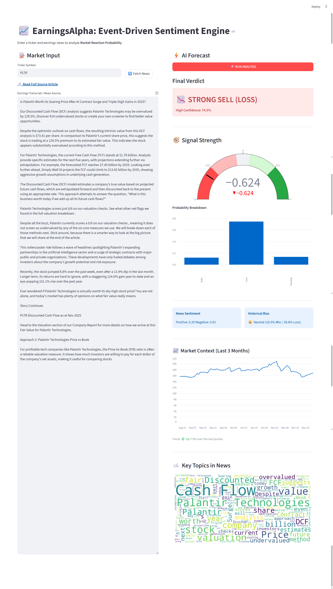

# 📈 EarningsAlpha: Event-Driven Sentiment Engine

[](https://earnings-alpha.streamlit.app)


**EarningsAlpha** is an end-to-end Machine Learning application that predicts post-earnings stock price direction by fusing **Natural Language Processing (NLP)** with **Historical Volatility Data**.

Unlike standard sentiment analyzers, this "Hybrid Architecture" acts as both an **Analyst** (reading the news) and a **Risk Manager** (checking the ticker's history) to prevent false positives on volatile stocks.

---

## 🧠 The Architecture: Analyst & Manager

The model uses a dual-input system to make decisions:

1.  **The Analyst (FinBERT):** A Transformer-based LLM (ProsusAI/FinBERT) analyzes earnings call transcripts and news headlines to extract nuanced sentiment (Positive/Negative/Neutral).
2.  **The Manager (XGBoost):** A Gradient Boosting Classifier evaluates the stock's **Historical Probability** of moving after earnings (via Target Encoding).

### 🚀 Key Logic Features
* **Cold-Start Handling:** Handles unknown tickers by assigning a calibrated "Soft Neutral" probability (0.45), preventing the model from making wild guesses on unseen stocks.
* **Sentiment Override:** A "Safety Valve" mechanism that forces the model to ignore historical trends if the news sentiment is overwhelmingly strong (>70%), allowing it to catch "Black Swan" events.
* **Tiered Verdicts:** Instead of binary Buy/Sell, the system outputs confidence tiers (**Strong Buy**, **Leaning Bullish**, **Neutral**, **Leaning Bearish**, **Strong Sell**) based on probability thresholds.

---

## 📊 Data Source

The model was trained on a dataset of **18,000+ earnings call transcripts** scraped from *The Motley Fool*, covering S&P 500 companies from 2016-2020.

* **Dataset:** [Motley Fool Scraped Earnings Call Transcripts (Kaggle)](https://www.kaggle.com/datasets/tpotterer/motley-fool-scraped-earnings-call-transcripts)
* **Preprocessing:** The raw text was cleaned, chunked, and aligned with historical stock price data (via `yfinance`) to label each event as *Gain* or *Loss* based on the 1-day post-earnings price movement.

---

## 📸 Demo & Performance

### 1. Strong Buy Signal (News + History Alignment)
*The model detects record-breaking bookings for **Take-Two Interactive (TTWO)**. With a Positive Sentiment of 0.78 and the "Sentiment Override" logic kicking in, the model boosts the historical probability, resulting in a **62.3% Confidence Strong Buy** signal.*


### 2. The "Safety Net" (Neutral Verdict)
*Despite generally positive news about **Apple (AAPL)** leadership, the model identifies the news as "informational" rather than "transactional" (Neutral Sentiment 0.91). Combined with Apple's historically stable post-earnings volatility, the model correctly predicts **Stability (Neutral)** with 80.8% confidence, filtering out the noise.*


### 3. "Sell the News" (Contrarian Logic)
*The model analyzes a valuation report for **Palantir (PLTR)** that highlights "Red Flags" and "129% Overvaluation." Despite Palantir's hype, the model combines the weak sentiment (Positive 0.20) with Palantir's bearish historical win rate (18.5%) to issue a **Strong Sell (74.5% Confidence)**.*


---

## 🛠️ Installation & Usage

### Option 1: Run Locally (Python)

1.  **Clone the repository:**
    ```bash
    git clone [https://github.com/YOUR_USERNAME/earnings-alpha.git](https://github.com/YOUR_USERNAME/earnings-alpha.git)
    cd earnings-alpha
    ```

2.  **Install Dependencies:**
    ```bash
    pip install -r requirements.txt
    ```

3.  **Run the App:**
    ```bash
    streamlit run app.py
    ```

### Option 2: Run with Docker

1.  **Build the Image:**
    ```bash
    docker build -t earnings-alpha:v1 .
    ```

2.  **Run the Container:**
    ```bash
    docker run -p 8501:8501 earnings-alpha:v1
    ```
    Access the app at `http://localhost:8501`.

---

## 📂 Project Structure

```text
earnings-alpha/
├── app.py                 # Main Streamlit Application
├── Dockerfile             # Container configuration
├── requirements.txt       # Python dependencies
├── models/                # Serialized ML artifacts
│   ├── final_xgb_model.joblib
│   ├── standard_scaler.joblib
│   └── (Encoders...)
├── notebooks/             # Research & Experimentation (Jupyter)
└── data/                  # (Excluded) Raw training data
```

---

## ⚠️ Constraints & Future Roadmap

* **Data Source:** Currently relies on the unofficial `yfinance` API. In a production environment, this would be replaced with a paid provider (e.g., Polygon.io or Bloomberg) to guarantee uptime and prevent rate-limiting.
* **Macro Factors:** The model focuses on *company-specific* sentiment and history. It does not currently account for macro events (Fed rate cuts, CPI data) which also drive price action.
* **Latency:** FinBERT inference on CPU takes ~2-3 seconds. Future iterations could use **ONNX quantization** or a distilled model to reduce latency to <500ms.